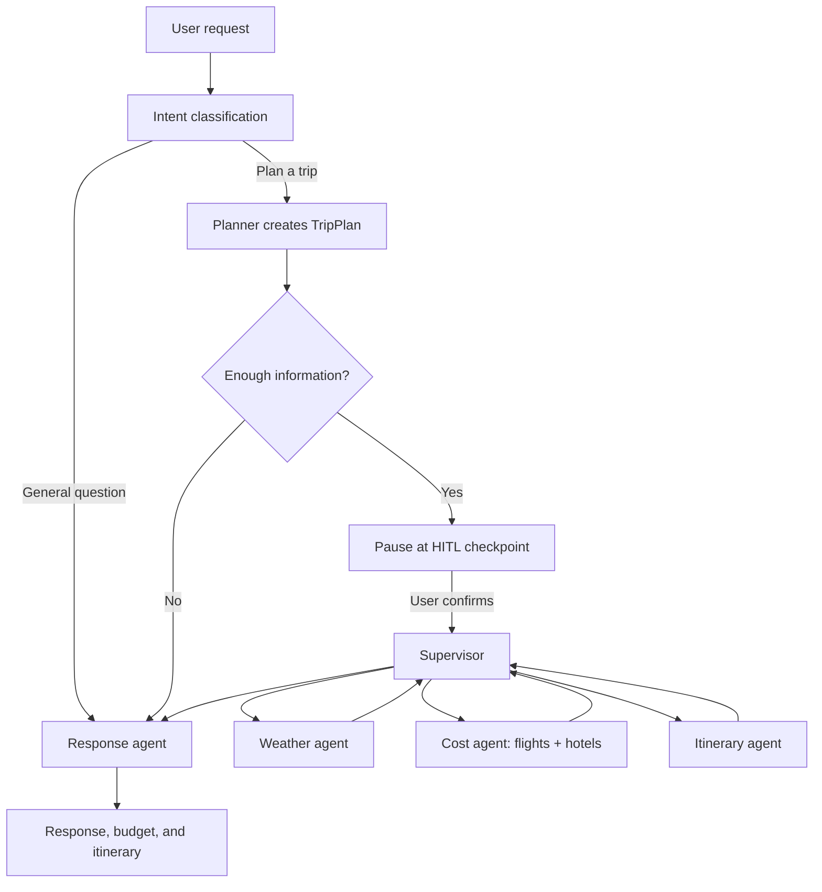

# Travel AI Assistant

A Vietnamese travel-planning assistant built with **FastAPI, LangGraph, and Google Gemini**. It turns a travel request into a structured plan, pauses for user approval, then gathers and consolidates cost, weather, and day-by-day itinerary information.

## Highlights

- **Human-in-the-Loop (HITL)**: a draft plan must be confirmed before detailed travel tasks run.
- **Durable LangGraph checkpoints**: SQLite lets a paused approval flow resume after a server restart.
- A supervisor coordinates the weather, cost/flight/hotel, and itinerary agents.
- Transparent flight and hotel data: SerpApi is used when configured; otherwise the app falls back to clearly labelled `fixture` data.
- Per-session plans, budget/risk reports, itineraries, and conversation history are stored in SQL Server.
- Built-in web UI with SSE updates for processing status and chat results.

## Workflow



## Data sources

| Data | Live source | Fallback | Notes |
|---|---|---|---|
| Flights | SerpApi Google Flights | Fixture | Results include `live` or `fixture` metadata. |
| Hotels | SerpApi Google Hotels | Fixture | Demo data is never presented as live data. |
| Weather | OpenWeatherMap | Unavailable notice | A key is required for live lookup. |
| Destination information | Tavily | No search call | Optional. |
| HITL checkpoints | SQLite | — | Default: `data/langgraph_checkpoints.sqlite`. |
| Session and UI data | SQL Server | — | Stores TripPlan, DecisionReport, itinerary, and chat history. |

## Project structure

```text
app/
├── agent/                 # LangGraph workflow, planner, supervisor, and agents
├── api/routes.py          # REST API and SSE streaming
├── providers/             # SerpApi gateway, normalizers, and fixture fallback
├── services/              # SQL Server store, calculator, weather, and search
├── models/                # Pydantic schemas and TripPlan
└── static/                # HTML/CSS/JavaScript web interface
tests/                     # HITL, provider, and decision-report tests
data/                      # SQLite checkpoints; runtime files are not committed
```

## Local setup

Requirements: Python 3.11+ and an accessible SQL Server instance. The Docker image uses Python 3.11.

```powershell
git clone <repository-url>
Set-Location "Travel AI Assistant"

python -m venv venv
.\venv\Scripts\Activate.ps1
pip install -r requirements.txt

Copy-Item .env.example .env
```

Set the required values in `.env`:

```env
GOOGLE_API_KEY="..."                 # Required
SQL_SERVER_HOST="localhost"
SQL_SERVER_PORT=1433
SQL_SERVER_DATABASE="Travel_AI_ASSISTANT"
SQL_SERVER_USER="sa"
SQL_SERVER_PASSWORD="..."

# Optional. Without SerpApi, clearly labelled fixtures are used.
SERPAPI_API_KEY="..."
OPENWEATHERMAP_API_KEY="..."
TAVILY_API_KEY="..."
CHECKPOINT_DB_PATH="data/langgraph_checkpoints.sqlite"
```

Start the application:

```powershell
uvicorn app.main:app --reload --host 0.0.0.0 --port 8000
```

Open [http://localhost:8000](http://localhost:8000). API documentation is available at [http://localhost:8000/docs](http://localhost:8000/docs).

## Docker

Ensure `.env` points to a SQL Server instance accessible from the container. If SQL Server runs on a Windows or macOS host, `host.docker.internal` is commonly used for `SQL_SERVER_HOST`.

```powershell
docker compose up -d --build
docker compose logs -f travel-assistant
```

Docker mounts `./data` at `/app/data`, preserving SQLite checkpoints when the container is recreated.

## API

| Method | Endpoint | Description |
|---|---|---|
| `GET` | `/api/health` | Service health check. |
| `POST` | `/api/chat` | Synchronous chat. |
| `POST` | `/api/chat/stream` | Chat over Server-Sent Events. |
| `GET` | `/api/trips/{session_id}` | Get the plan, budget/risk report, itinerary, and history. |
| `POST` | `/api/trips/{session_id}/confirm` | Confirm a plan and resume the HITL workflow. |
| `PATCH` | `/api/trips/{session_id}/plan` | Edit a TripPlan, return it to draft, and recalculate the estimate. |

Example request:

```text
Plan a 3-day trip to Da Nang from Hanoi for two people,
with an 8,000,000 VND budget and a preference for food and beaches.
```

The application creates a draft plan. Selecting **Confirm plan** then continues the workflow and updates the estimate, risks, and daily itinerary.

## Testing

```powershell
.\venv\Scripts\python.exe -m compileall app
.\venv\Scripts\python.exe -m unittest tests.test_hitl_graph tests.test_provider_gateway tests.test_decision_sync -v
node --check app\static\js\app.js
```

The tests do not require real API keys: live provider responses are mocked and fixture behavior is tested separately.

## Current limitations

- The app provides search and recommendations only; it does not take payments or make bookings.
- Flight and hotel prices can change. Fixture results are for demonstration only and are explicitly labelled.
- SQL Server is required for session data. SQLite persists LangGraph checkpoints only and does not replace the session store.
- CORS currently allows every origin for development convenience; restrict allowed domains before a production deployment.

## Reference

The document structure was inspired by [Jmhzbmcn2/Travel-AI-Assistant](https://github.com/Jmhzbmcn2/Travel-AI-Assistant). The architecture and instructions in this README describe this codebase only.
